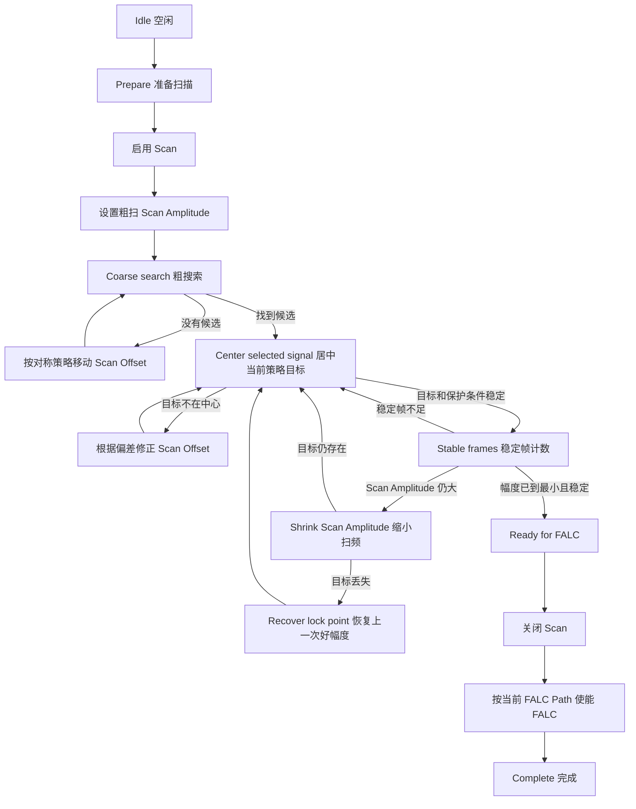

# 自动锁频2算法配置与使用说明

本文档对应当前“自动锁频2”的最新实现。当前版本支持三套可切换算法：

```text
1. 透射峰全过程主导
2. 误差信号全过程主导
3. 透射峰粗找 + 误差信号精调
```

三套算法共享同一套采集、Scan Offset / Scan Amplitude 写入、缩小扫频、Ready for FALC 和 FALC 使能流程；区别在于“粗找阶段看谁、精调阶段把谁居中、谁作为保护条件”。这样后续实验可以直接切换策略，比较哪一种更适合当前腔和探测器信号。

相关代码位置：

- `controllers/auto_lock2_controller.py`
- `controllers/auto_lock2_acquisition.py`
- `controllers/auto_lock2_settings.py`
- `controllers/auto_lock2_strategies/transmission_primary.py`
- `controllers/auto_lock2_strategies/error_primary.py`
- `controllers/auto_lock2_strategies/hybrid.py`
- `windows/auto_lock2_window.py`
- `widgets/auto_lock2/signal_plot.py`

## 1. 设计思路

真实手动锁腔时，实验员会同时看透射峰和误差信号，但不同阶段关注点不同：

- 透射峰直接说明腔是否扫到共振。
- 误差信号说明 FALC/PID 最后能不能在零点附近接管。
- 两路信号互相保护，可以减少噪声、毛刺、伪零点造成的误判。

当前软件把这个判断拆成三种策略，便于实验对照。

### 1.1 透射峰全过程主导

这个模式最接近“先确认示波器上是否存在清晰透射峰”的人工调试习惯：

```text
粗找：看 transmission peak
居中：把 transmission peak 放到扫描中心
缩小幅度：确认 transmission peak 仍然稳定存在
Ready：最后再要求 error zero 靠近 peak 且斜率合格
```

适合用于验证“透射峰是否足够可靠地代表共振位置”。

### 1.2 误差信号全过程主导

这个模式沿用前一版 PDH 思路。实验员如果主要看误差信号，这套最贴近：

```text
粗找：看受透射峰保护的 PDH error zero
居中：把 error zero 放到扫描中心
缩小幅度：确认受保护 error zero 仍然稳定存在
Ready：error zero、斜率、transmission guard 同时满足
```

适合误差信号很干净、零交叉很明显的情况。

### 1.3 透射峰粗找 + 误差信号精调

这是推荐默认模式：

```text
粗找：先用 transmission peak 确认扫到腔共振
靠近：如果 error zero 暂时不合格，先把 peak 拉近中心
精调：error zero 合格后，切换到 error zero 居中
Ready：error zero + transmission guard 同时满足
```

它的思路是：先用透射峰找到“腔在哪里”，再用误差信号决定“能不能锁”。

## 2. 输入和输出

输入信号：

- `transmission`：透射峰信号。
- `error`：误差信号。

两个通道在三种模式中的权重不同：

| 模式 | 主观察信号 | 辅助/保护信号 |
|---|---|---|
| 透射峰全过程主导 | transmission peak | error zero |
| 误差信号全过程主导 | error zero | transmission peak |
| 透射峰粗找 + 误差信号精调 | 粗找看 transmission，精调看 error | 两路互相保护 |

控制输出：

- `Scan Offset`：移动扫频窗口，让 PDH 零点移动到扫描周期中心。
- `Scan Amplitude`：先用大幅度搜索，再逐步缩小扫频范围。

当前版本会自动开启 Scan。达到 Ready 后会关闭 Scan，并按当前 FALC Path Selection 使能 FALC。

当前版本不会自动修改：

- Scan Output
- Scan Frequency
- Scan Shape

程序只会在日志中提醒这些设置是否符合推荐值：

```text
Scan Output: PC Voltage(50)
Scan Frequency: near 1 Hz
Scan Shape: Triangle(1)
```

## 3. 状态机



## 4. 信号分析算法

每一帧采集后，程序会同时分析 `error` 和 `transmission`。

### 4.1 误差信号零点

程序在 error 信号中寻找零交叉：

```text
error[i] == 0
或 error[i] * error[i+1] < 0
```

找到跨零点后，用相邻两个采样点做线性插值，估算零点在当前帧中的位置：

```text
zero_fraction = 0 到 1 的归一化位置
```

其中：

- `0` 表示这一帧最左侧。
- `0.5` 表示扫描周期中心。
- `1` 表示这一帧最右侧。

### 4.2 误差信号斜率

只找到零点还不够。噪声也可能跨零，所以程序还会计算零点附近的斜率：

```text
zero_slope = abs(error[i+1] - error[i]) * (n - 1)
```

同时估计 error 差分噪声：

```text
slope_noise = MAD(diff(error)) * 1.4826
```

斜率阈值为：

```text
slope_threshold = max(最小误差斜率, 误差斜率 sigma * slope_noise)
```

只有：

```text
zero_slope >= slope_threshold
```

才认为这是一个清晰的 PDH 零点。

### 4.3 透射峰保护

程序还会从 transmission 中找峰：

```text
baseline = median(transmission)
noise = MAD(transmission) * 1.4826
peak_prominence = max(transmission) - baseline
peak_threshold = max(最小透射峰突出量, 透射峰阈值 sigma * noise)
```

只有：

```text
peak_prominence >= peak_threshold
```

才认为透射峰有效。

然后计算误差零点和透射峰的距离：

```text
zero_to_peak_distance = abs(zero_fraction - peak_fraction)
```

只有：

```text
zero_to_peak_distance <= 透射峰保护容差
```

才认为这个 error zero 被 transmission peak 保护。

最终候选锁点条件是：

```text
error zero exists
error zero slope is strong enough
transmission peak exists
transmission peak is near error zero
```

## 5. Offset 如何调整

### 5.1 粗搜索

如果没有找到受保护的 PDH 零点，程序按对称策略移动 Scan Offset：

```text
start_offset + 1 * step
start_offset - 1 * step
start_offset + 2 * step
start_offset - 2 * step
...
```

这样不会一开始就朝单方向跑，而是从当前位置向两边扩展搜索。

### 5.2 零点居中

找到受保护的 PDH 零点后，程序把目标从透射峰改为误差信号零点：

```text
center_error = zero_fraction - 0.5
```

如果：

```text
abs(center_error) > 误差零点居中容差
```

就继续写 Scan Offset，把零点移到扫描中心。

程序不会假设 Offset 增大时零点一定往左或往右。它会先做一个小探测，测量：

```text
offset_to_error_zero_response = delta_zero_fraction / delta_offset
```

然后根据这个响应计算下一次 Offset 修正。

## 6. Scan Amplitude 如何缩小

当误差零点居中、斜率足够、透射峰保护通过，并连续满足若干帧后，程序会缩小 Scan Amplitude：

```text
new_amplitude = max(最小扫频幅度, current_amplitude * 缩小比例)
```

缩小后继续判断。

如果缩小后受保护的 PDH 零点丢失，程序会恢复上一次保存的好 Scan Amplitude。

## 7. Ready for FALC 条件

进入 Ready 前必须满足：

- PDH 误差信号零点存在。
- 零点斜率超过阈值。
- 透射峰存在。
- 透射峰在误差零点附近。
- 误差零点在扫描周期中心附近。
- 连续满足稳定帧数。
- Scan Amplitude 已缩小到最小扫频幅度附近。

Ready 后程序会：

1. 关闭 Scan。
2. 检查 FALC 模块。
3. 读取当前 FALC Path Selection。
4. 按当前 Path Selection 使能 FALC。

## 8. 算法配置参数

配置窗口现在按四组显示参数：

- 公共参数：三套算法都会使用，控制搜索幅度、步进、稳定帧和修正增益。
- 透射峰参数：用于 transmission peak 检测、峰居中和透射峰质量判断。
- 误差信号参数：用于 error zero 检测、零点居中和斜率判断。
- 双信号保护参数：用于判断透射峰和误差零点是否互相对应。

每个参数右侧会显示当前算法模式下的角色：

| 角色 | 含义 |
|---|---|
| 通用 | 所有算法模式都会使用 |
| 主控 | 当前算法主要依赖这个参数进行搜索、居中或稳定判断 |
| 辅助 | 当前算法会使用这个参数，但它不是主要搜索或居中目标 |
| 保护 | 用于交叉验证，防止假峰、假零点或噪声误判 |
| 未用 | 当前算法基本不使用，保留给其它算法模式 |

| 参数 | 默认值 | 作用 |
|---|---:|---|
| 算法模式 | `透射峰粗找 + 误差信号精调` | 在三套算法之间切换 |
| 粗扫幅度 | `1.0` | 初始粗找时写入的 Scan Amplitude |
| 最小扫频幅度 | `0.08` | 最终缩小到的 Scan Amplitude 下限 |
| 缩小比例 | `0.65` | 每次缩小 Scan Amplitude 的比例 |
| Offset 搜索步进 | `0.05` | 粗搜索和响应探测的 Offset 步长 |
| 透射峰居中容差 | `0.06` | transmission peak 离扫描中心的最大允许偏差 |
| 误差零点居中容差 | `0.06` | error zero 离扫描中心的最大允许偏差 |
| 透射峰保护容差 | `0.08` | transmission peak 离 error zero 的最大允许距离 |
| 误差斜率 sigma | `5.0` | error zero 斜率相对噪声的阈值倍率 |
| 最小误差斜率 | `0.02` | error zero 的绝对最小斜率 |
| 透射峰阈值 sigma | `5.0` | transmission peak 相对噪声的阈值倍率 |
| 最小透射峰突出量 | `0.04` | transmission peak 相对基线的最小突出量 |
| 稳定帧数 | `3` | 连续多少帧满足条件才进入下一步 |
| 最大 Offset 尝试 | `80` | 粗搜索最多移动 Offset 的次数 |
| Offset 修正增益 | `0.7` | 零点居中时的 Offset 修正比例 |

## 9. 参数影响

### 算法模式

透射峰全过程主导：更符合“先看高透射峰”的经验，适合透射峰强、误差信号暂时不稳定时测试。  
误差信号全过程主导：更接近 PDH 锁定本质，适合误差信号干净、零点明显时测试。  
透射峰粗找 + 误差信号精调：先靠透射峰找到共振，再靠误差信号决定锁点，推荐作为默认对照模式。

### 粗扫幅度

调大：更容易扫到远处共振，但波形更复杂。  
调小：搜索更快，但如果当前 Offset 离锁点远，可能找不到。

### 最小扫频幅度

调大：不容易丢锁点，但接 FALC 前范围较宽。  
调小：锁点更精细，但缩小过程中更容易丢失。

### 缩小比例

调大：每次缩小更温和，更稳。  
调小：收敛更快，但可能突然丢失受保护零点。

### Offset 搜索步进

调大：粗搜索更快，但可能跨过窄锁点。  
调小：更细致，但耗时更长。

### 透射峰居中容差

调大：透射峰不必非常靠近中心也能进入下一步，速度更快。  
调小：峰必须更居中，适合验证透射峰主导模式，但会增加 Offset 修正次数。

在“透射峰全过程主导”中它是主控参数；在“透射峰粗找 + 误差信号精调”中，它用于误差信号尚未合格前的靠峰过渡；在“误差信号全过程主导”中基本不使用。

### 误差零点居中容差

调大：更容易进入下一步，但零点可能没有真正居中。  
调小：更严格，更适合接 FALC，但需要更多 Offset 修正。

### 透射峰保护容差

调大：允许 error zero 和 transmission peak 有更大时间偏移。  
调小：更能防止假零点，但对采样同步更敏感。

### 误差斜率 sigma

调大：更抗噪，只接受斜率很清楚的 PDH 零点。  
调小：能接受弱 PDH 信号，但更容易误判噪声零点。

### 最小误差斜率

调大：防止平坦零点或噪声零点通过。  
调小：更容易捕获弱信号，但假零点风险增加。

### 透射峰阈值 sigma

调大：只接受明显透射峰。  
调小：弱峰也能通过，但毛刺风险增加。

### 最小透射峰突出量

调大：要求透射峰更明显。  
调小：允许更弱透射峰，适合光强低时测试。

### 稳定帧数

调大：更可靠但更慢。  
调小：更快但容易被单帧噪声影响。

### 最大 Offset 尝试

调大：搜索范围更宽。  
调小：失败更快，不会长时间乱扫。

### Offset 修正增益

调大：零点居中更快，但容易过冲。  
调小：更平滑，但需要更多帧。

## 10. 配置窗口使用

算法配置窗口现在支持：

- 本地算法配置预设保存、加载、切换和删除。
- 参数按“公共 / 透射峰 / 误差信号 / 双信号保护”分组。
- 每个参数右侧显示当前算法模式下的角色：通用、主控、辅助、保护或未用。
- 顶部公共“调节步进”按钮。
- 每个参数右侧有“当前调节”按钮。
- 每个参数右侧有 `!` 说明按钮。

使用方式：

1. 需要从零开始调参时，点“新建配置”，输入配置名称。
2. 点某个参数右侧的“当前调节”。
3. 顶部选择步进，例如 `0.01` 或 `0.001`。
4. 用该参数输入框的上下箭头微调。
5. 点 `!` 查看这个参数为什么存在、调大调小有什么影响。
6. 点“保存配置”把当前算法模式和 14 个数值参数写入本地预设文件。
7. 需要复现实验条件时，在“已保存配置”里选中配置，点“加载/切换配置”。
8. 点 OK 应用当前配置页里的参数。

预设文件保存在项目根目录：

```text
auto_lock2_algorithm_presets.json
```

预设只保存算法配置页里的算法模式和 14 个数值参数，不保存采集源、波形、日志、当前运行阶段和 FALC 状态。
点“加载/切换配置”后，配置会立即同步到自动锁频2控制器；点 OK 也会再次应用当前页面参数。

注意：算法运行中配置窗口会禁用，避免运行时改变参数导致判断链路不一致。

## 11. 日志关键词

```text
PDH zero candidate found
```

表示已经找到受透射峰保护的误差信号零点。

```text
no protected PDH zero
```

表示当前帧没有同时满足 error zero、斜率和 transmission guard。

```text
center PDH zero
```

表示程序正在通过 Scan Offset 把误差信号零点移动到扫描中心。

```text
protected PDH zero lost
```

表示缩小扫频或居中后，受保护的零点丢失，需要恢复。

```text
Ready for FALC
```

表示误差信号零点、斜率、透射峰保护、稳定帧数和最小扫频幅度都满足，可以关闭 Scan 并接 FALC。

## 12. 调试建议

如果总是找不到锁点：

- 检查 error 通道是否接对。
- 检查 error 是否真的有 S 型零交叉。
- 降低误差斜率 sigma 或最小误差斜率。
- 增大粗扫幅度或最大 Offset 尝试。

如果有 error 零点但不通过保护：

- 检查 transmission 通道是否接对。
- 增大透射峰保护容差。
- 降低透射峰阈值 sigma 或最小透射峰突出量。
- 检查示波器采样窗口是否和 1 Hz 扫频同步。

如果零点来回过冲：

- 降低 Offset 修正增益。
- 降低 Offset 搜索步进。
- 适当放宽误差零点居中容差。

如果缩小 Scan Amplitude 后丢点：

- 增大缩小比例。
- 增大最小扫频幅度。
- 提高稳定帧数。

## 13. 一句话总结

自动锁频2现在的核心是：用 PDH 误差信号零交叉和斜率寻找真正可锁点，用透射峰确认该零点确实对应腔共振，再通过 Scan Offset 把零点居中，通过 Scan Amplitude 逐步缩小扫频范围，最后关闭 Scan 并使能 FALC。
